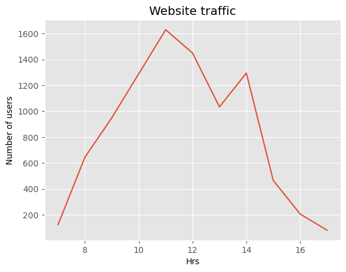
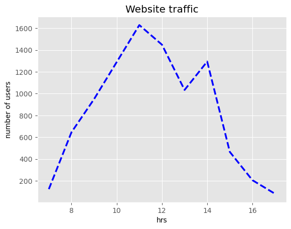
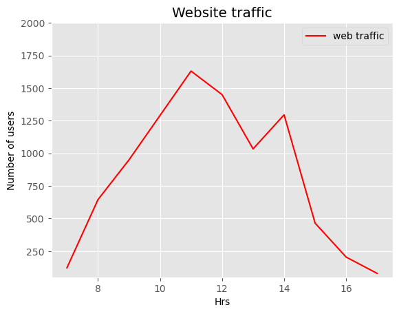
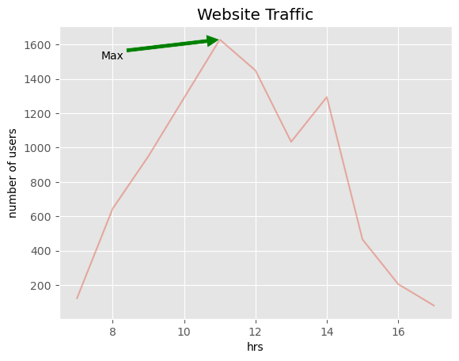
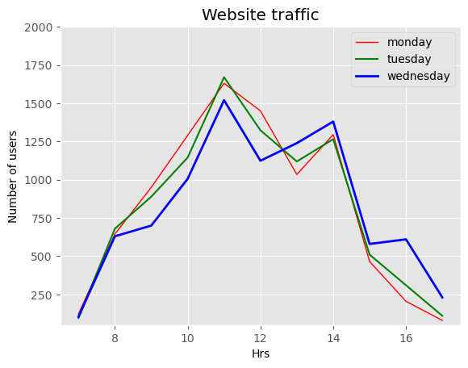

## Plot With(x,y)

A Nutri world-wide firm wants to know how many people visits its website in a particular time. This analysis helps it control and monitor the website traffic.    

2D Plot = Users and Time


```python
#import matplotib library

import matplotlib.pyplot as plt
from matplotlib import style
%matplotlib inline
```


```python
#website traffic data
#number of users/ visitors on the website
web_customers= [123,645,950,1290,1630,1450,1034,1295,465,205,80]
#Time distribution (hourly)
time_hrs= [7,8,9,10,11,12,13,14,15,16,17]
```


```python
#select the style of the plot
style.use('ggplot')
#plot the website traffic data (x-axis hrs and y axis as number of users)
plt.plot(time_hrs,web_customers)
#set the title of the plot
plt.title('Website traffic')
#set Label for x axis
plt.xlabel('Hrs')
#set label for y axis
plt.ylabel('Number of users')
plt.show()
```


    

    


### Controlling Line Patterns and Colors


```python
#select the style of the plot 

style.use('ggplot')

#plot the website traffic data (x axis hrs and y axis as number of users)

plt.plot(time_hrs,web_customers,color= 'b', linestyle='--', linewidth=2.5)

#set the title of the plot

plt.title('Website traffic')

#set the label for x axis

plt.xlabel('hrs')

#set the label for y axis

plt.ylabel('number of users')

plt.show()
```


    

    


### Set Axis, Labels, and Legend Property


```python
#select the style of the plot

style.use('ggplot')

#plot the website traffic data (x-axis hrs and y axis as number of users)

plt.plot(time_hrs, web_customers, 'r', label= 'web traffic', linewidth=1.5)

plt.axis([6.5,17.5,50,2000])

#set the title of the plot

plt.title('Website traffic')

#set label for x axis

plt.xlabel('Hrs')

#set label y axis

plt.ylabel('Number of users')
plt.legend()
plt.show()
```


    

    


## Alpha and Annotation 


```python
#select the style of the plot

style.use('ggplot')

#plot the website traffic data (x axis hrs and y axis as number of users)

#also setting the alpha value for transparency

plt.plot(time_hrs, web_customers, alpha=.4)


#set the title of the plot

plt.title('Website Traffic')

#Annotate

plt.annotate('Max', ha='center', va='bottom', xytext=(8,1500), xy=(11,1630), arrowprops=
            {'facecolor': 'green'})

#set the label for x axis

plt.xlabel('hrs')

#set the label for y axis

plt.ylabel('number of users')

plt.show()


```


    

    


- Max: denotes the annotation text,
- ha : indicates the horizontal alignment,
- va: indicates the vertical alignment,
- xytext: indicates the arrow position,
- arrowprops indicates the properties of the arrow.

## Multiple Plots


```python
#website traffic data

#number of users /visitors on the website 

#monday web traffic
web_monday = [123,645,950,1290,1630,1450,1034,1295,465,205,80]

#tuesday web traffic
web_tuesday = [95,680,889,1145,1670,1323,1119,1265,510,310,110]

#wednesday web traffic
web_wednesday = [105,630,700,1006,1520,1124,1239,1380,580,610,230]

#Time distribution (hourly)

time_hrs = [7,8,9,10,11,12,13,14,15,16,17]
```


```python
#select the style of the plot
style.use('ggplot')

#plot the website traffic data (x axis hrs and y axis as number of users)
#plot the monday web traffic with red color

plt.plot(time_hrs, web_monday,'r',label ='monday', linewidth=1)

#plot the tuesday web traffic with green color

plt.plot(time_hrs,web_tuesday,'g',label ='tuesday', linewidth=1.5)


#plot the tuesday web traffic with blue color

plt.plot(time_hrs,web_wednesday,'b', label ='wednesday', linewidth=2)

plt.axis ([6.5,17.5,50,2000])

#set the title of the plot 

plt.title('Website traffic')

#set label for x axis

plt.xlabel('Hrs')


#set label for y axis

plt.ylabel('Number of users')

plt.legend()
plt.show()

```


    

    


```python

```


```python

```
